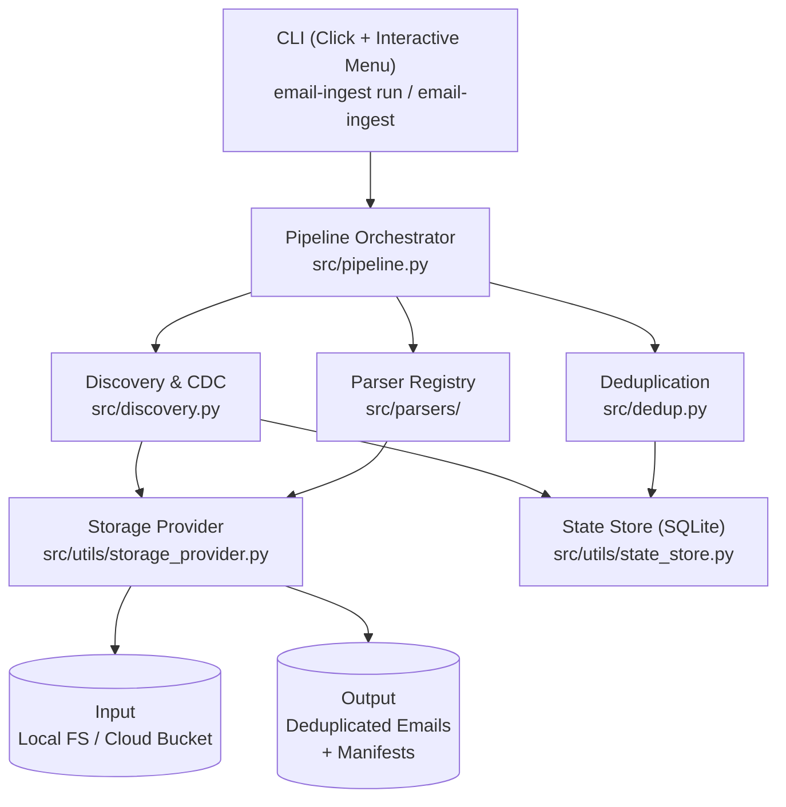
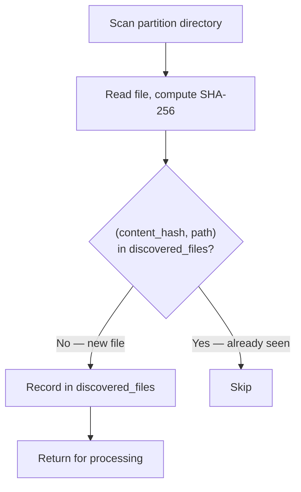
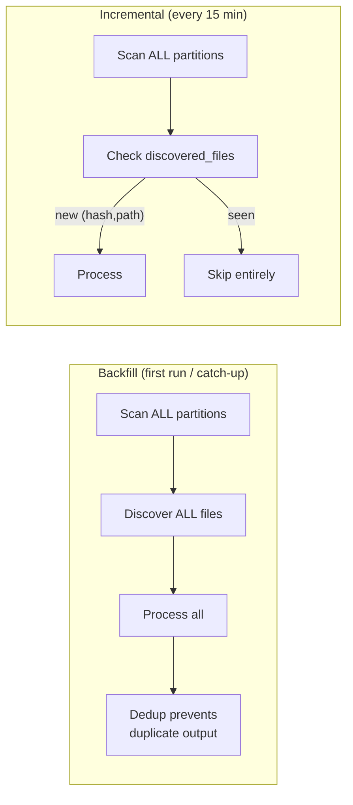

# Design Document

## Architecture Overview



The pipeline runs in four phases:

```
1. DISCOVER  →  2. UNPACK  →  3. DEDUP  →  4. STAGE
   Scan dirs     Recursive      Content      Write to
   CDC check     containers     SHA-256      output/
                 → leaf emails  check        + manifest
```

---

## Project Structure

```
src/
├── main.py               # CLI entrypoint — interactive menu + direct commands
├── pipeline.py           # Orchestrator — wires all phases together
├── discovery.py          # File discovery, format detection, CDC
├── dedup.py              # Content-hash UID generation and duplicate checking
├── models.py             # Pydantic schemas (SourceLineage, ProcessedEmail, etc.)
├── parsers/              # Strategy pattern — one parser per format
│   ├── base.py           # ABC: BaseParser + ParseResult
│   ├── eml_parser.py     # .eml → single email + attachments
│   ├── html_parser.py    # .html → single email
│   ├── zip_parser.py     # .zip → extracted entries (handles errors)
│   └── mbox_parser.py    # .mbox → individual messages
└── utils/
    ├── storage_provider.py   # ABC — swap FileProvider for S3Provider later
    ├── file_provider.py      # Local filesystem implementation
    ├── state_store.py        # SQLite persistence (discovered, processed, runs)
    └── hashing.py            # SHA-256 content hashing
```

---

## Key Design Decisions

### 1. Unique Identifier — Content SHA-256

Each email's UID is the SHA-256 hash of its raw content bytes.

**Why content hash over path or filename:**

| Approach | Problem |
|----------|---------|
| Path-based UID | Same email in a ZIP and standalone → two different UIDs → no dedup |
| Filename-based | Two PSTs both produce `001.eml` → false dedup (different emails, same name) |
| **Content hash** | Same content = same UID regardless of path. Different content = different UID regardless of name. |

This gives us **global dedup** — identical content found in different partitions, different containers, or different pipeline runs is processed exactly once.

### 2. Change Data Capture (CDC)

#### What is CDC?

CDC is a pattern for answering: **"What's new since the last time I looked?"** Instead of reprocessing every file on every run, we track what we've already seen so we only handle the delta. The term originates from database replication — capturing row-level inserts/updates/deletes to keep systems in sync — but the same idea applies to file ingestion: only process files that haven't been processed before.

#### Why we need it

Without CDC, every pipeline run re-reads and re-processes everything:

```
Run 1:  100 files → process 100     ✓ (first run, all new)
Run 2:  103 files → process 103     ✗ (100 already done — wasted work)
Run 3:  110 files → process 110     ✗ (gets worse as data grows)
```

With CDC:

```
Run 1:  100 files → all new  → process 100, record in state
Run 2:  103 files → 3 new   → process 3
Run 3:  110 files → 7 new   → process 7
```

#### CDC method: content-hash based polling

The pipeline implements **poll-based CDC with content hashing**. On each run it scans all directories, but uses a SQLite lookup table to decide what's new:



The state lives in the `discovered_files` table, keyed by `(content_hash, path)`:

| content_hash | path |
|---|---|
| `a1b2c3...` | `/ns_a/timestamp=2024-07-15/email.eml` |
| `d4e5f6...` | `/ns_a/timestamp=2024-07-15/batch.zip` |

This composite key handles three scenarios:
- **Same file, same path** → already seen → skip
- **Same path, new content** (file was replaced) → different hash → process as new
- **Same content, different path** (duplicate file) → new entry → discovered, but dedup catches it downstream

#### Why content hash over timestamps?

| Approach | Failure mode |
|----------|-------------|
| File modification time | Clock skew between uploader and pipeline; cloud storage doesn't guarantee `mtime` accuracy |
| "Files newer than last run" | Misses files uploaded during a run; backfill re-runs break entirely |
| **Content hash + path** | Deterministic, clock-independent, handles replacements and duplicates |

#### Two modes in practice



- **Backfill**: Skips the `discovered_files` check — treats everything as new. Safe to re-run because content-hash dedup at the email level (the `processed_files` table) prevents duplicate output.
- **Incremental**: Checks `discovered_files` for each source file. If `(content_hash, path)` exists → skips the file entirely without unpacking or processing.

#### CDC vs Dedup — two layers, two jobs

This is the key architectural insight — the pipeline has **two separate safeguards** operating at different levels:

```
                            INPUT SIDE                    OUTPUT SIDE
                        ┌─────────────────┐          ┌─────────────────┐
                        │       CDC       │          │      Dedup      │
                        │ discovered_files│          │ processed_files │
                        ├─────────────────┤          ├─────────────────┤
  Answers:              │ "Have I seen    │          │ "Have I already │
                        │  this SOURCE    │          │  written this   │
                        │  FILE before?"  │          │  EMAIL before?" │
                        ├─────────────────┤          ├─────────────────┤
  Key:                  │ (hash, path)    │          │ content_hash    │
                        ├─────────────────┤          ├─────────────────┤
  Prevents:             │ Re-reading and  │          │ Writing the     │
                        │ re-unpacking    │          │ same email      │
                        │ containers      │          │ twice           │
                        └─────────────────┘          └─────────────────┘
```

You need both. CDC alone can't catch an email that appears both as a standalone `.eml` AND inside a `.zip` — those are different source files with different paths. Dedup catches it after unpacking because the email content is identical.

#### Crash recovery

SQLite uses WAL (Write-Ahead Logging) mode. If the pipeline crashes mid-run:
- Already-discovered files are in `discovered_files` → won't be re-discovered in incremental mode
- Already-processed emails are in `processed_files` → dedup skips them even in backfill mode
- Partially-unpacked containers will be re-read, but their already-processed emails are caught by dedup

No data is lost, no duplicates are created.

#### What changes at scale

In production, polling every 15 minutes is replaced by **event-driven CDC**: cloud storage emits notifications (S3 Events, GCS Pub/Sub) when new objects are created, pushed to a queue. Same concept — "what's new" — but push-based instead of pull-based. Backfill still uses a one-time directory scan. See [scaling.md](./scaling.md) for details.

### 3. Parser Strategy Pattern

Parsers are pluggable via a registry. Each format is a single file implementing `BaseParser`:

```python
PARSER_REGISTRY: dict[FileFormat, BaseParser] = {
    FileFormat.EML:  EmlParser(),
    FileFormat.HTML: HtmlParser(),
    FileFormat.ZIP:  ZipParser(),
    FileFormat.MBOX: MboxParser(),
}
```

Adding a new format = one new file + one registry entry. See [concerns.md](./concerns.md) for a step-by-step guide.

### 4. Recursive Container Unpacking

Containers are unpacked recursively. The pipeline's `_process_file` function:

1. Detects format → gets parser from registry
2. If **container** → parse extracts entries → recurse on each entry
3. If **single email** → dedup check → write to output
4. If **unknown** → record as skipped

This handles arbitrary nesting: `ZIP → ZIP → MBOX → emails`.

**Lineage**: Each processed email carries a `SourceLineage` with:
- `namespace` — customer namespace
- `date_partition` — which date folder it came from
- `source_file` — the original top-level file
- `container_path` — ordered list of containers it was nested in
- `original_filename` — the leaf filename

### 5. Storage Abstraction

`StorageProvider` is an ABC. The P0 implementation (`FileProvider`) uses the local filesystem via `pathlib`. The interface is designed so a cloud SDK implementation (`S3Provider`, `GCSProvider`) can be swapped in without changing any pipeline logic — just the composition root.

### 6. Attachments

EML attachments are extracted via the standard library's `email.message_from_bytes()` and stored alongside the parent email:

```
output/{namespace}/timestamp={date}/
  {uid}.eml                          # The email
  {uid}_attachments/                 # Sibling directory
    report.pdf
    image.png
```

The manifest entry links them via `has_attachments: true` and `attachment_dir`.

---

## Output Format

```
output/
  {namespace}/
    timestamp={date}/
      {sha256}.eml
      {sha256}.html
      {sha256}_attachments/
        filename.pdf
  manifest.jsonl          # One JSON object per processed email
  skipped.jsonl           # One JSON object per skipped file
```

**manifest.jsonl** — each line contains: `uid`, `source_lineage` (full chain), `format`, `content_hash`, `output_path`, `has_attachments`, `attachment_dir`, `processed_at`.

**skipped.jsonl** — each line contains: `path`, `reason`, `namespace`, `date_partition`, `discovered_at`.

---

## Edge Case Decisions

| # | Edge Case | Behavior | Rationale |
|---|-----------|----------|-----------|
| 1 | Same filename in different partitions | Both processed | Different content = different SHA-256 = different UIDs |
| 2 | ZIP containing another ZIP | Recursive unpacking | `_process_file` recurses — lineage tracks the full chain |
| 3 | Two MBOXes with same-name outputs | Both processed | Content-based UID — different message bodies = different hashes |
| 4 | Password-protected ZIP | Skipped | Caught via `RuntimeError`, logged to `skipped.jsonl` as `password_protected` |
| 5 | Corrupted ZIP | Skipped | Caught via `BadZipFile`, logged to `skipped.jsonl` as `corrupted` |
| 6 | Non-email files mixed in | Skipped | No parser in registry → `unsupported_format` |
| 7 | Empty container | No output | Empty `ParseResult`, logged as warning |
| 8 | Pipeline crash + restart | Resume safely | SQLite state persists — dedup prevents reprocessing |
| 9 | Same file re-uploaded | Incremental skips | Same `(content_hash, path)` in `discovered_files` → skip |
| 10 | Deep nesting (ZIP → ZIP → MBOX) | Full recursive unpacking | Arbitrary depth supported, lineage tracks every level |

---

## Technology Choices

| Concern | JS/TS Equivalent | Python Choice | Why |
|---------|-----------------|---------------|-----|
| Schema validation | Zod | Pydantic v2 | Industry standard, runtime validation + serialization |
| CLI framework | Commander / yargs | Click | Mature, composable, decorator-based |
| Interactive menus | Inquirer.js | simple-term-menu | Lightweight, terminal-native |
| Testing | Jest / Vitest | pytest | De facto standard, fixture system, plugins |
| Linting + formatting | ESLint + Prettier | Ruff | Single tool, extremely fast, replaces both |
| Package management | pnpm | uv | Fast, lockfile-based, replaces pip + virtualenv |
| Structured logging | pino / winston | loguru | Beautiful defaults, zero config, structured output |
| State persistence | better-sqlite3 | sqlite3 (stdlib) | Zero dependencies, ACID, WAL mode |

---

## AI Process Documentation

AI tools (Claude) were used at every stage:

1. **Planning** — Analyzed assignment requirements, designed architecture, chose Python packages (translating from JS/TS ecosystem), created detailed task breakdown with sub-tasks and progress tracking.

2. **Implementation** — Built all modules following the plan: models → storage abstraction → parser registry → discovery → dedup → pipeline orchestrator → CLI. Each component was smoke-tested immediately after implementation.

3. **Testing** — Generated comprehensive programmatic test fixtures covering all 10 edge cases. Wrote 70 tests across 4 test files (unit + integration).

4. **Documentation** — Wrote design docs, scaling analysis, concerns/limitations, and README.

All planning artifacts and specification documents are preserved in the repository's git history.
