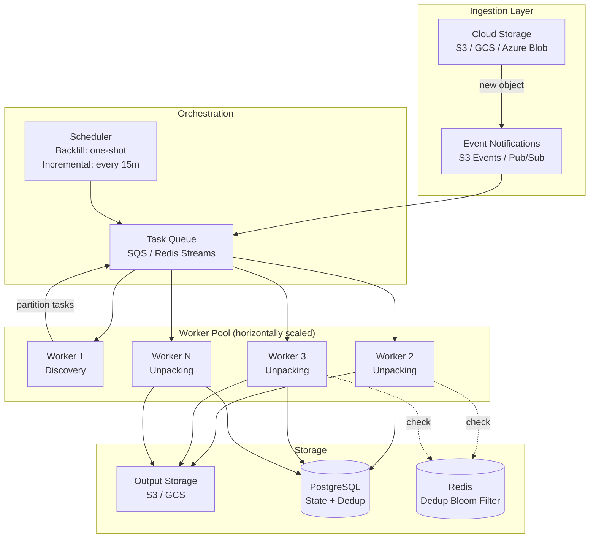

# P1 — Scaling Considerations

## Current Bottlenecks

The P0 pipeline is single-threaded, single-process, and loads entire files into memory. This works for the test dataset but won't survive production traffic: multi-GB PST archives, thousands of files per partition, and dozens of customers uploading concurrently.

---

## Architecture at Scale

---

## Key Scaling Challenges & Solutions

### 1. Large Archives (multi-GB PST/ZIP)

**Problem**: P0 reads entire file into memory → OOM on large files.

**Solution**: Stream-based extraction. Both `zipfile` and PST libraries support iterating entries without loading the full archive. Extract one entry at a time, process it, write output, move on. Set a per-worker memory limit and reject files that exceed it (route to a dedicated large-file worker with more RAM).

### 2. Thousands of Files Per Partition

**Problem**: Sequential discovery and processing becomes a time bottleneck.

**Solution**: Parallelize at two levels:
- **Discovery**: One task per `(namespace, partition)` pair. Each task lists files and enqueues individual file-processing tasks.
- **Processing**: Workers pull from the queue independently. No coordination needed because dedup is handled by the database (content hash as primary key with `INSERT ... ON CONFLICT DO NOTHING`).

Use `concurrent.futures.ProcessPoolExecutor` for single-machine parallelism, or a task queue (Celery, Dramatiq, or AWS SQS consumers) for multi-machine.

### 3. Multiple Customers (Multi-Tenancy)

**Problem**: Customers shouldn't starve each other. A customer uploading 100k files shouldn't block another customer's 10-file incremental run.

**Solution**: Per-namespace priority queues. Each customer gets a fair share of worker capacity. Implement priority: incremental runs > backfill runs (incremental has a 15-minute SLA, backfill is best-effort).

### 4. Dedup at Scale

**Problem**: SQLite can't handle concurrent writers. Content hash lookups become slow at millions of rows.

**Solution**:
- Replace SQLite with **PostgreSQL** — supports concurrent writes, proper indexing, row-level locking.
- Add a **Redis Bloom filter** as a fast first-pass check. If the Bloom filter says "not seen" → definitely new. If "maybe seen" → check PostgreSQL. This cuts database reads by ~99% for new files.
- Index `processed_files.content_hash` with a B-tree index (already the primary key).

### 5. CDC Without Polling

**Problem**: P0 polls every 15 minutes by listing directories. At scale, listing large buckets is slow and expensive.

**Solution**: Event-driven discovery using cloud storage notifications:
- **AWS**: S3 Event Notifications → SQS
- **GCP**: Cloud Storage Pub/Sub notifications
- **Azure**: Blob Storage Event Grid

New object events are pushed to a queue. Workers consume events instead of polling. Backfill still requires a one-time bucket listing, but incremental runs become event-driven with near-zero latency.

### 6. Crash Recovery & Idempotency

**Problem**: A worker crashes mid-extraction of a 500-email MBOX. On restart, how do we avoid re-processing the 200 already-handled emails?

**Solution**: Already handled by content-hash dedup — re-processing the same email is a no-op (detected as duplicate). The queue provides at-least-once delivery; dedup provides exactly-once processing. Mark the source file as "fully processed" only after all extracted emails are committed. If a worker dies, the task returns to the queue and is retried — already-processed emails are skipped via dedup.

### 7. Observability

**Problem**: P0 has log output only. At scale, you need to answer "why is namespace X stuck?" within seconds.

**Solution**:
- **Structured logging** (loguru already supports this) → ship to centralized logging (ELK, Datadog)
- **Prometheus metrics**: `files_discovered_total`, `files_processed_total`, `processing_duration_seconds`, `queue_depth`, `dedup_hit_rate`
- **Alerting**: Alert on queue depth growth, processing latency P99, error rate spikes

---

## Migration Path from P0

The P0 architecture was designed with this migration in mind:

| P0 Component | P1 Replacement | Migration Effort |
|---|---|---|
| `StorageProvider` ABC → `FileProvider` | Implement `S3Provider` | Low — swap at composition root |
| SQLite `StateStore` | PostgreSQL `StateStore` | Medium — same interface, new SQL dialect |
| Sequential `pipeline.py` | Task queue workers | Medium — split `_process_file` into queue consumer |
| `scan_all()` polling | S3 event → SQS consumer | Medium — new discovery path, keep scan for backfill |
| In-memory file reads | Streaming extraction | High — requires parser interface changes |
| `PARSER_REGISTRY` dict | Same pattern, add MSG/PST parsers | Low — plug in new parsers |

The parser strategy pattern, storage abstraction, and content-hash dedup all carry over unchanged. The main work is replacing the sequential orchestrator with a queue-based architecture.
